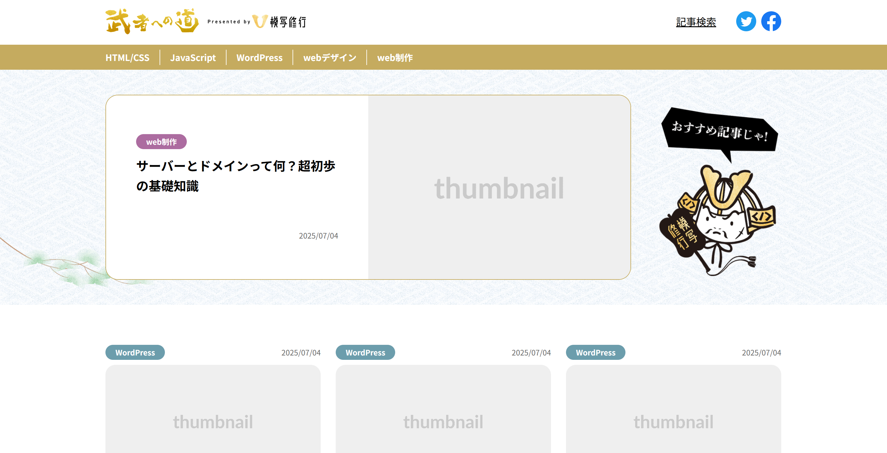

# 🌿 武者への道（架空サイト）

**🔗 デモ URL:** https://hiron-folio.com/portfolio/wp-works/road-to-musha/

Hello Mentor 課題で制作したメディアサイト。  
WordPress テーマを自作し、管理画面を最適化。

---

## 🖥 使用技術

WordPress / PHP / HTML / SCSS / JavaScript  
Local 開発環境

## 🚀 制作ポイント

- 記事の**キーワード検索機能**を実装
- KV の記事を管理画面で選択可能
- フロントとエディターの見た目を統一
- コードとデザインの再利用性を意識した設計
- レスポンシブ対応（SP・PC）
- SEO SIMPLE PACK によるメタ設定

## 🧭 開発環境（概要）

### 必要な環境

- Node.js
- LocalWP（WordPress のローカル環境）

### 推奨エディターと拡張機能（Cursor / VS Code）

- **Live Sass Compiler**：SCSS のリアルタイムコンパイル
- **PHP Sniffer & Beautifier**：PHP コードの自動整形と規約チェック
- **Prettier**：SCSS / JS / JSON 等のコード整形

### 開発ワークフロー（概要）

1. LocalWP で WordPress を起動
2. `npm install` で依存関係をインストール
3. `npm run dev` で BrowserSync によるホットリロード開始
4. ファイル編集 → 自動リロードで確認

## 🧩 開発環境セットアップ詳細

このテーマは Node.js + BrowserSync を用いて開発効率を高めています。  
以下の手順でローカル環境を構築できます。

---

### 必要な環境

- Node.js（推奨: LTS 版）
- LocalWP（WordPress ローカル環境）

---

### セットアップ手順

1. テーマディレクトリに移動

   ```bash
   cd wp-content/themes/road-to-musha
   ```

2. 依存関係をインストール

   ```bash
   npm install
   ```

3. `package.json` の BrowserSync の URL を自分の環境に合わせて変更  
   例）LocalWP のサイト URL が `http://example.local` の場合

   ```json
   {
     "scripts": {
       "dev": "browser-sync start --proxy 'http://example.local' --files '**/*.php' '**/*.css' '**/*.js' --no-notify --no-open"
     }
   }
   ```

---

### 開発の開始

ファイルを保存すると自動でブラウザがリロードされます。

```bash
npm run dev


実行後、ターミナルに表示される URL（通常は http://localhost:3000）にアクセスしてください。

※ WordPress の元の URL（例：http://example.local）ではなく、
BrowserSync が提供する URL（http://localhost:3000）を使用します。
```

### 監視対象ファイル

以下のファイルが BrowserSync により自動的に監視されます。  
これらを編集・保存すると、ブラウザが自動でリロードされます。

```text
**/*.php - PHP ファイル
**/*.css - CSS ファイル
**/*.js  - JavaScript ファイル
```

### 注意事項

```text
node_modules/ は Git にコミットしない
新しい依存パッケージを追加したら package.json をコミット
他の開発者は npm install で同じ環境を再現可能
DB やプラグイン設定は WPvivid で共有
```
